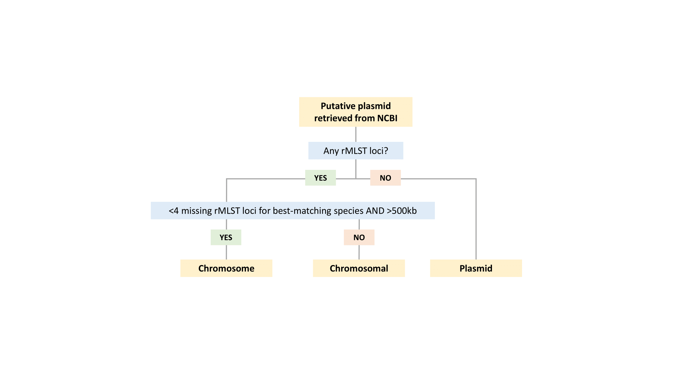
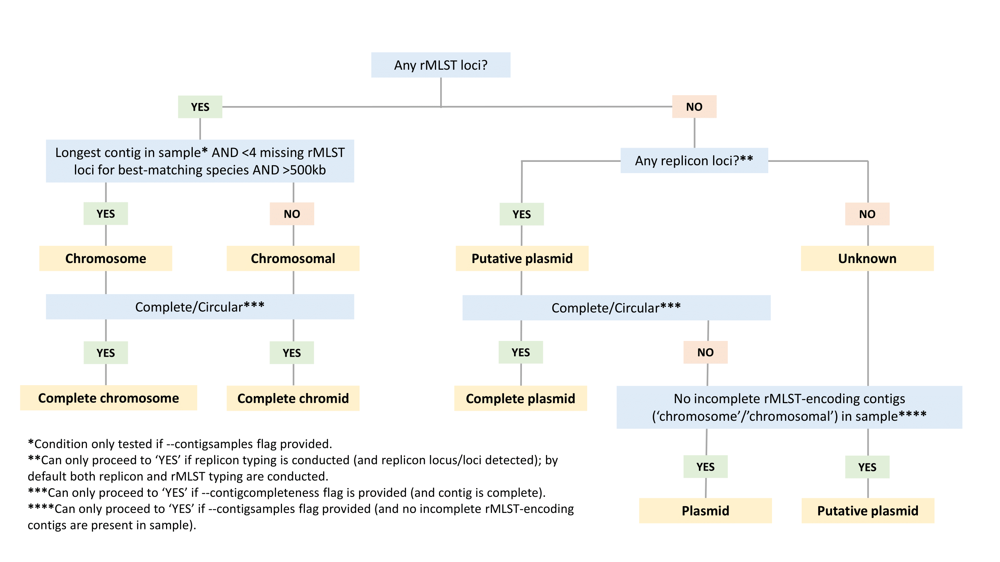

# bacterialBercow

bacterialBercow is a command-line tool for retrieving and curating complete bacterial plasmids from the [NCBI nucleotide](https://www.ncbi.nlm.nih.gov/nucleotide/) database; and for characterising and classifying contigs from your own bacterial sequence assemblies.

# Table of contents

* [Introduction](#Introduction)
* [Requirements](#Requirements)
* [Installation](#Installation)
* [Quick start](#Quick-start)
* [Background and methods](#Background-and-methods)
* [Options and usage](#Options-and-usage)
* [Output files](#Output-files)
* [FAQ](#faq)
* [Acknowledgements](#Acknowledgements)
* [License](#License)


# Introduction

The main functionalities of bacterialBercow are described below:<br>

__Retrieving complete bacterial plasmids from NCBI__:<br>
Retrieving complete plasmid sequences from the NCBI nucleotide database requires quality-filtering to exclude partial plasmid sequences, or chromosomal sequences mis-annotated as plasmids. I previously outlined methods to curate NCBI bacterial plasmids ([Orlek _et al_. 2017](https://www.ncbi.nlm.nih.gov/pubmed/28286183)). Following similar methods, bacterialBercow allows users to first retrieve putative complete bacterial plasmid sequences from NCBI, and then characterise these sequences by detecting plasmid [replicon loci](https://www.ncbi.nlm.nih.gov/pmc/articles/PMC4068535/) and ribosomal multi-locus sequence typing ([rMLST](https://pubmlst.org/rmlst/)) loci ([Jolley _et al._ 2012](https://mic.microbiologyresearch.org/content/journal/micro/10.1099/mic.0.055459-0#tab2)). rMLST loci can be used as markers of chromosomal sequence. As a result, chromosomal sequence misannotated as plasmid can be excluded and genuine complete plasmid sequences can be identified. bacterialBercow is not the only available tool for retrieving curated plasmid sequences. [PLSDB](https://ccb-microbe.cs.uni-saarland.de/plsdb) is an online database of curated plasmids, updated every ~3 months, so this is an easy way to get hold of NCBI plasmid sequences, and as an online database it comes with nice interactive features. Associated code is also available [here](https://github.com/VGalata/plsdb). However, there are reasons why you may want to use bacterialBercow for plasmid retrieval/curation (see [FAQ](#faq) for details).

__Classifying contigs from complete/near-complete bacterial sequence assemblies as plasmid, chromosome, etc.__:<br>
As well as helping to classify/curate NCBI sequences, bacterialBercow can be used to classify in-house (user-provided) sequence assemblies. As above, rMLST loci can be used to help identify chromosomal sequence. Additional user-provided information, namely, source sample, and completeness (e.g. whether the contig assembled to form a complete circular sequence) can be used to help refine contig classification as plasmid, chromosome, [chromid](https://www.ncbi.nlm.nih.gov/pubmed/20080407), or incomplete chromosomal sequence. Chromids are secondary replicons which are intermediate between chromosomes and plasmids (e.g. unlike plasmids, they encode at least one essential gene, but on the other hand, they encode plasmid-like replication loci). If you are dealing with complete assemblies from bacterial taxa that tend not to harbour chromids, then assigning the longest contig as the chromosome and all other contigs as plasmids is reasonable. However, even with long-reads, bacterial assemblies may not be perfectly resolved such that one contig represents one replicon ([Wick 2017](https://www.ncbi.nlm.nih.gov/pmc/articles/PMC5695209/)). bacterialBercow is a more robust approach for contig classification, and is especially useful when dealing with assemblies that are near-complete but not perfectly resoved, and/or when taxa are known to sometimes harbour chromids. As far as I know, there are currently no other automated tools for classifying contigs in complete/near-complete assemblies. Note that bacterialBercow is not intended for contig classification of fragmented assemblies (derived from short-read sequencing data). In this case, accurate classification of all contigs may not be achievable, although there are automated tools that aim to address this goal ([Arredondo-Alonso _et al._ 2017](https://www.ncbi.nlm.nih.gov/pmc/articles/PMC5695206/)).

__Characterising bacterial sequence assemblies__:<br>
bacterialBercow also allows users to characterise their own in-house assembled sequences (both complete and fragmented assemblies), using [plasmid replicon typing](https://www.ncbi.nlm.nih.gov/pmc/articles/PMC4068535/) and [rMLST typing](https://pubmlst.org/rmlst/). Plasmid replicon typing and rMLST have applications in plasmid epidemiology (see [Orlek _et al._ 2017](https://www.ncbi.nlm.nih.gov/pubmed/28232822)), and bacterial speciation, respectively. As far as I know, there are currently no other command-line tools for rMLST-based taxonomy (only the [rMLST website](https://pubmlst.org/rmlst/)). Replicon typing and rMLST-based bacterial speciation can be conducted on fragmented assemblies as well as complete assemblies; bacterial species can be determined based on alleleic variation at rMLST loci ([Larsen _et al._ 2014](https://www.ncbi.nlm.nih.gov/pubmed/24574292)), even if loci are partitioned across contigs of a fragmented assembly. It may also be possible to determine species or genus-level taxonomic information from incomplete chromosomal sequence, if sufficient rMLST loci are represented.<br>

__Detecting contamination__:<br>
Included in the rMLST output is the number of multi-allelic loci. Generally MLST schemes are devised such that a chromosome will encode one allele per locus, so multi-allelic loci indicate potential cross-species or intra-species bacterial contamination. An existing tool called ConFindr is available for read-based contamination analysis using rMLST typing ([Low _et al._ 2019](https://www.ncbi.nlm.nih.gov/pmc/articles/PMC6546082/)).


# Requirements


* Linux or MacOS (with the [Bash shell](https://en.wikibooks.org/wiki/Bash_Shell_Scripting#What_is_Bash?), which is the default shell on MacOS and many Linux distributions)
* [Python](https://www.python.org/). Python 3 or Python 2.
* Ensure the following Python packages are installed: [Biopython](https://biopython.org/wiki/Download) and [Rauth](https://rauth.readthedocs.io/en/latest/).
* [BLAST+](https://www.ncbi.nlm.nih.gov/books/NBK52640/#_chapter1_Installation_) (tested using version 2.6.0)
* [edirect](https://www.ncbi.nlm.nih.gov/books/NBK179288/)
* A computer with a stable internet connection via the HTTPS protocol - required for retrieving data from NCBI.
* [bioawk](https://github.com/lh3/bioawk)
* The [rMLST database](https://pubmlst.org/rmlst/) (follow installation instructions below - DO NOT try to install yourself since the installation script provided must be run to get the database in the required format)
* The [PlasmidFinder database](https://bitbucket.org/genomicepidemiology/plasmidfinder/src/master/) (follow installation instructions below - DO NOT try to install yourself since the installation script provided must be run to get the database in the required format)


# Installation

First install the repository:<br>

```bash
git clone https://github.com/AlexOrlek/bacterialBercow.git
cd bacterialBercow
```
You should find the executable scripts (`order.py`, `rmlst_setup.py` and `plasmidfinder_setup.py`) within the repository directory. If you add the path of this directory to your [$PATH variable](https://www.computerhope.com/issues/ch001647.htm), then bacterialBercow can be run by calling the executable scripts e.g. `order.py [`*`arguments...`*`]` from any directory location.

__Installing the rMLST database__:

The ribsomal multi-locus sequence typing (rMLST) database comprises sequences of allelic ribosomal loci; these sequences can be used as chromosomal markers i.e to detect chromosomal as opposed to plasmid sequence. The database is free, but you will need to agree to an associated licence agreement which __forbids the distribution of the database__, in order to protect the Intellectual Property.

To gain access and install the database, follow these steps:
* Register for a PubMLST account if you do not already have one. The link to register is [here](https://pubmlst.org/bigsdb). Click on "Register for a site-wide account".
* Login to your account at https://pubmlst.org/bigsdb and request access to Ribosomal MLST genome and Ribosomal MLST locus/sequence definitions under Registrations. Additionally, email Keith Jolley (keith.jolley@zoo.ox.ac.uk) and request a consumer id and secret so that you'll be able to access the database programatically.
* Put your consumer id and secret into a text file (file name does not matter), with the id on the first line and the secret on the second. The file contents should look something like the below snippet:

```bash
efKXmqp2D0EBlMBkZaGC2lPf
F$M+fQ2AFFB2YBDfF9fpHF^qSWJdmmN%L4Fxf5Gur3
```

* Install the database by running the `rmlst_setup.py` executable, providing the `-s` flag with the file containing the secret id and secret:<br>

```bash
rmlst_setup.py -s secretfile.txt
```

* Follow the instructions that appear on screeen. The rMLST database will be installed in the databases directory within the repository.


__Installing the PlasmidFinder database__:

* Install the database by running the `plasmidfinder_setup.py` executable:<br>

```bash
plasmidfinder_setup.py
```


# Quick start

To retrieve and curate bacterial plasmids from NCBI:

`order.py -e first.last@email.com -o output-directory`


To retrieve and curate a custom set of NCBI accessions:

`order.py -e first.last@email.com --accessions accessions.txt -o output-directory`


To characterise and classify your own bacterial sequences using plasmid replicon typing and rMLST, provide an input multi-FASTA file; optional files specifying contig completeness and contig sample affiliation can be provided to refine classification (using `--contigcompleteness` and `--contigsamples` flags respectively):

`order.py --inhousesequences samples.fasta -o output-directory --contigcompleteness contigcompletenessfile.tsv --contigsamples contigsamplesfile.tsv`


If you have a fragmented assembly (assembled from short-reads), then unambiguously classifying all contigs will not be possible. You can instead restrict contig ouput to include only contigs with a replicon or rMLST locus detected (`--typedcontigsonly`) and you can request output at the sample-level (`--sampleoutput`). In the case of fragmented assemblies, analysing at the sample-level is more informative in terms of rMLST speciation and picking up multi-allelic rMLST loci, so it's especially important to delimit sample groupings by providing the --contigsamples flag so that analysis can be conducted at the sample-level:

`order.py --inhousesequences samples.fasta -o output-directory --contigsamples contigsamplesfie.tsv --typedontigsonly --sampleoutput`


# Options and usage

`order.py --help` produces a summary of all the options. All commands must include the `-o` flag specifying output directory. The other key flags are summarised below:<br>

By default, the number of threads is 1, but multi-threading is recommended to reduce the computing time of the BLAST searches; the number of threads to use is specified using the `-t` flag; the value must not exceed the number of threads available on your machine.<br>

__NCBI query and retrieval options__:<br>
A contact email address must be provided using the `-e` flag; this is so that NCBI have someone to notify in case the software causes problems for their server.<br>
The `--taxonomyquery` and `--datequery` flags allow the NCBI query to be customised according to the source organism of the accession and the date the accession was first added to NCBI. Note that the taxonomy id associated with a given organism can be found through the [NCBI Taxonomy Browser](https://www.ncbi.nlm.nih.gov/Taxonomy/Browser/wwwtax.cgi). For example, the command below would retrieve _Klebsiella aerogenes_ plasmids, added since the start of 2017:<br>

`order.py -e first.last@email.com -o output-directory --taxonomyquery 'txid548[ORGN]' --datequery '"2017/01/01"[PDAT] : "3000"[PDAT]'`

The `-s` flag specifies which NCBI source database(s) to include; by default both Refseq and Genbank databases will be included (`refseq_genbank`) but Refseq only can be specified (`refseq`).<br>
The `--deduplicationmethod` flag specifies how identical sequences should be deduplicated (see [Background and methods](#background-and-methods) and [FAQ](#faq) for details).<br>

__Customising NCBI pipeline steps by specifying starting and stopping points__:<br>
If provided, the `--retrieveaccessionsonly` flag will stop the pipeline after `accessions_filtered.tsv` is produced (see [Output files](#output-files) and [Background and methods](#background-and-methods)).<br>
If provided, the `--retrievesequencesonly` flag will stop the pipeline after `accessions_filtered_deduplicated.fa` is produced.<br>
If provided, the `--restartwithsequences` flag will re-start the pipeline from the point where `--retrievesequencesonly` stopped the pipeline. The output directory specified must be the same as the output directory that was previously specified when the pipeline was run with the `--retrievesequencesonly` flag.<br>
The `--accessions` flag allows a user to bypass the NCBI query stage, and instead use a custom set of NCBI accessions. Accessions can be provided in "accession" or "accession.version" format; however, if the accession version has been updated on the NCBI server, then using an older accession.version as input will produce an error, so providing accessions without .version suffixes is more robust.<br>
<br>
_Example 1: you wish to update an existing database with more recent accessions:_<br>
You could run bacterialBercow with the `--retrieveaccessionsonly` flag, and compare retrieved accessions with those in the existing database to identify novel putative plasmid accessions that you may wish to include. Then, you could run the next stage of bacterialBercow by providing the set of novel putative plasmids to the `--accessions` flag to determine plasmid accessions to be included in the existing database.<br>
<br>
_Example 2: you have access to a computer cluster which can be run with lots of `--threads` but for security reasons, the HTTPS protocol (required for accessing data from NCBI) is not permitted:_<br>
You could run bacterialBercow in two stages. First, on your own computer, run bacterialBercow with the `--retrievesequencesonly` flag. Then, with the same output directory (`-o` flag) specified, run the typing stage of the pipeline on your computer cluster by providing the `--restartwithsequences` flag along with lots of `--threads`. Running in two stages as described also offers the opportunity to check that data has been successfully retrieved from NCBI before running with the `--restartwithsequences` flag. For example, accessions_filtered.tsv should contain the same number of nucleotide accessions as accessions_filtered.fa and accessions_filtered_dblinks.tsv (see [Output files](#output-files)).


__Customising in-house contig pipeline steps__:<br>
The `--inhousesequences` flag allows a user to provide their own multi-FASTA file of sequences which will be characterised using replicon typing and/or rMLST typing.<br>
By default both replicon and rMLST typing will be conducted on in-house sequences, but a user can specify only `replicon` typing or only `rmlst` typing using the `--typing` flag. For accessions retrieved from NCBI, both replicon and rMLST typing are performed.<br>
<br>
Providing information about how contigs group according to source sample can improve contig classification. Specifically, a chromosome should be the longest contig in a sample. A tsv file containing contig names in the first column and associated sample names in the second column can be provided with the `--contigsamples` flag.<br>
Known information about contig completeness or circularity (e.g. as provided by assemblers such as [Unicycler](https://github.com/rrwick/Unicycler)), can be included when classifying contigs. A tsv file containing contig names in the first column and contig completeness information in the second column can be provided with the `--contigcompleteness` flag. Contigs labelled as 'circular', 'complete', or 'complete_linear' will be considered to be complete sequences. Other accepted contig labels are 'linear','incomplete', and 'unknown'.<br>
<br>
By default, typing information is provided on a contig by contig basis. However, especially for framgented assemblies, sample-level typing information can be more useful. If provided, the `--sampleoutput` flag specifies that output should be provided at the sample-level (sampletyping.tsv) as well as the contig level (contigtyping.tsv).<br>
The `--typedcontigsonly` flag, if provided, means that only typed contigs will be included in the contig-level output file.<br>


# Output files

The below table shows the outputs from running the complete pipeline (including retrieval of accessions from NCBI) with default settings.

File/Directory            	        | Description
--------------------------------------- | --------------------------------------------------------------------------------------------- 
downloaddate.txt		        | a record of when the accessions were retrieved
accessions.tsv			        | putative plasmid accessions retrieved from NCBI
incompleteaccessions.tsv       	        | as above but not annotated as complete; these accessions are excluded
accessions_filtered.tsv        	        | accessions remaining, after filtering based on accession title text
excludedaccessions.tsv	     	        | accessions excluded, after filtering based on accession title text  
accessions_filtered_dblinks.tsv         | BioSample and BioProject accession ids associated with nucleotide accessions from accessions_filtered.tsv  
accessions_filtered_metadata.tsv        | BioSample accessions and metadata (submitter name and owner name)
accessions_filtered_refseq_gb.tsv       | Refseq accessions and their cognate Genbank accessions
accessions_filtered_morebioprojects.tsv | see below for explanation **\*** 
identicalaccessions.tsv		        | information on accessions with identical sequences, including corresponding submitter metadata and BioProject accession ids 
accessions_filtered.fa                  | sequences of accessions_filtered.tsv
accessions_filtered_deduplicated.tsv	| accessions remaining after removal of duplicate sequences
accessions_filtered_deduplicated.fa     | sequences of accessions_filtered_deduplicated.tsv
plasmidfinder/                	        | directory containing outputs from BLASTing remaining sequences against plasmid replicon loci
rmlst/                        	        | directory containing output from BLASTing remaining sequences against chromosomal rMLST loci
plasmids.fa		     	        | plasmid sequences  
plasmids.tsv		     	        | information on plasmid sequences including replicon typing
nonplasmids.tsv			        | information on non-plasmid sequences including replicon typing and rMLST typing

**\*** Contains additional BioProject accession ids of missing cognate Genbank accessions (present in accessions_filtered_refseq_gb.tsv, but missing in accessions_filtered.tsv). Cognate Genbank accessions may be missing for the following reasons: 1) Only Refseq accessions were retrieved i.e. the `refseq` argument was provided to the `-s` flag; 2) Both Refseq and Genbank accessions were retrieved, but the Genbank accession was not included in accessions_filtered.tsv, most likely because annotation details differed between Refseq and Genbank accessions e.g. the Refseq accession was annotated as complete but the Genbank accession was not; therefore the Genbank accession was excluded as incomplete.<br>
<br>

The below table shows outputs from running the pipeline with the `--inhousesequences` flag provided.

File/Directory            	    | Description
----------------------------------- | --------------------------------------------------------------------------------------------- 
plasmidfinder/                	    | directory containing outputs from BLASTing sequences against plasmid replicon loci
rmlst/                        	    | directory containing output from BLASTing sequences against chromosomal rMLST loci
contigtyping.tsv		    | replicon and/or rMLST typing, and contig classification 

<br>


# Background and methods

For background information on curating NCBI plasmids see recent papers: [Orlek _et al._ (2017)](https://www.ncbi.nlm.nih.gov/pubmed/28286183) and [Galata _et al._ (2018)](https://academic.oup.com/nar/article/47/D1/D195/5149885). A brief outline of the steps of the complete pipeline (starting with retrieval from NCBI) is given below. Details of the --inhousesequences version of the pipeline are discussed at the bottom of this section. 

1. Putative complete plasmid accessions, along with accompanying information such as accession title are downloaded from NCBI nucleotide. To be considered a putative plasmid, the accession must be annotated as "plasmid" and "complete".
2. To select for complete plasmid genomes, the accessions are filtered using a regular expression search of the accession title text. For example, titles including the words "gene", "transposon", or "synthetic vector" would be excluded.
3. The filtered accession sequences are downloaded as a FASTA file. If both Refseq and Genbank accessions have been retrieved, there will be duplicates with identical nucleotide sequences; therefore, deduplication is conducted, leaving only one sequence from the set of duplicate sequences, favouring retention of Refseq over Genbank accessions. Deduplication is conducted even if only Refseq accessions are provided (identical sequences may be present in Refseq). Deduplication is conducted according to the argument provided to the `--deduplicationmethod` flag:
    * `all`: all duplicate sequences are filtered, leaving only one representative sequence.
    * `bioproject`: sequences are deduplicated if they share the same BioSample accession id, and/or the same BioProject accession id.
    * `submitter`: sequences are deduplicated if they share the same BioSample accession id, and/or at least one piece of submitter metadata (submitter contact name and submitter affiliation name, from the [BioSample "Owner"](https://www.ncbi.nlm.nih.gov/books/NBK169436/) field).
    * `both` : sequences are deduplicated if they share the same BioSample accession id, and/or BioProject accession id, and/or at least one piece of submitter metadata (default method). 
    
    The aim of the `bioproject`, `submitter`, and `both` methods is to allow for interesting duplicates to be retained - identical plasmids from distinct samples and sequencing projects, that may represent transmission of a conserved plasmid between different epidemiological settings. Nucleotide accessions originating from the same biological sample should share the same BioSample accession; nucleotide accessions originating from the same sequencing project should share the same primary BioProject id ([Pruitt 2011](https://www.ncbi.nlm.nih.gov/books/NBK54015/), [Barrett 2012](https://www.ncbi.nlm.nih.gov/pubmed/22139929), [Benson 2013](https://academic.oup.com/nar/article/41/D1/D36/1068219)). However, in Refseq, higher-level primary BioProject accessions [can be created by NCBI staff](https://www.ncbi.nlm.nih.gov/bioproject/docs/faq/#what-is-project-type), e.g. [PRJNA224116](https://www.ncbi.nlm.nih.gov/bioproject/?term=PRJNA224116). This breaks the correspondence between Refseq BioProject accession and sequencing project; therefore, for Refseq accessions the original BioProject accession id is retrieved via the cognate Genbank accession.    
4. The remaining sequences are BLASTed against the PlasmidFinder replicon database and the rMLST database.
5. If a sequence contains no rMLST loci then it is considered a plasmid and included in the plasmids.fa output file (although see "caveats" in the [FAQ](#faq) section for potential limitations of this approach). Note that to be considered a plasmid, a replicon locus need not be detected, and indeed it is not that uncommon to encounter plasmids with no known replicon locus. Therefore, replicon typing is not essential to the plasmid curation methodology as it stands, but is included since it is widely used by the plasmid community to describe plasmids and gain insight into plasmid epidemiology.
6. Accessions with rMLST loci detected are recorded in nonplasmids.tsv. Contigs are classified as chromosome or chromosomal (=incomplete chromosome sequence or chromid sequence) based on the decision tree below. Plasmid replicon types, if present, are assigned (chromids and chromosomes can contain plasmid replicons). rMLST-based species predictions are assigned to sequences (although it may not be possible to assign species unambiguously if insufficient loci are detected for a given sequence).

<br>

If in-house sequences are provided (`--inhousesequences`), replicon typing and rMLST are conducted (step 4), but a different possible decision tree is implemented for classifying contigs (see below), and typing information/contig classification is output in one file (typing.tsv). With NCBI-retrieved sequences, completeness information may be unreliable so is not used to inform contig classification decisions. Neither is contig source sample affiliation. In contrast, with in-house assemblies, users can provide trusted information about contig completeness and source sample affiliation using the `--contigcompleteness` and `--contigsamples` flags. This information is used to inform contig classification.


<br>
<p align="center">Decision tree for sequences retrieved from NCBI</p>
<p align="center"></p>
<br>
<br>
<p align="center">Decision tree for in-house sequences</p>
<p align="center"></p>
<br>


# FAQ

* **Why is the tool called bacterialBercow?**
[John Bercow](https://en.wikipedia.org/wiki/John_Bercow) is a former [Speaker of the House of Commons](https://en.wikipedia.org/wiki/Speaker_of_the_House_of_Commons_(United_Kingdom)); he was responsible for bringing order to UK parliamentary debates during [unruly times](https://www.youtube.com/watch?v=EY7EIZl4raY), and did so by yelling "Order! Ordeerr!". As I explained in my "Ordering the mob" paper, these are unruly times for microbiologists too - faced with a deluge of bacterial genome sequences, available via NCBI and from in-house sequencing projects. 
* **How do the methods of bacterialBercow differ from previously published methods for retrieving and curating NCBI plasmids?**
I previously published a similar method for plasmid curation ([Orlek _et al._ 2017](https://www.ncbi.nlm.nih.gov/pubmed/28286183)), but compared with bacterialBercow, the methods in the paper differ in several key ways:
    * I used [MLST](https://pubmlst.org/general.shtml) rather than rMLST to filter chromosomal accessions. MLST loci are more limited as a chromosomal marker since MLST schemes cover fewer taxa.
    * I used a less stringent and more convoluted approach to decide whether a plasmid sequence was compete: accessions were not required to be annotated as "complete" as long as the title text indicated a "complete" sequence; bacterialBercow instead excludes any accession that is not annotated as "complete", but does not require explicit mention of completeness in the title text.<br>
    
    [Galata _et al._ (2018)](https://academic.oup.com/nar/article/47/D1/D195/5149885) created [PLSDB](https://ccb-microbe.cs.uni-saarland.de/plsdb) using methods similar to those of the bacterialBercow pipeline. However, methods of Galata _et al._ differ somewhat; notably:
    * Although rMLST loci are used to filter chromosomal sequences, in contrast to methods of bacterialBercow, sequences with up to 5 rMLST loci are included in the database. However, according to a recent review article ([di Cenzo & Finan 2017](https://mmbr.asm.org/content/81/3/e00019-17)), a plasmid-like sequence encoding one or more ribosomal loci should actually be considered a "chromid", which is biologically distinct from a plasmid ([Harrison _et al._ 2010](https://www.ncbi.nlm.nih.gov/pubmed/20080407)). bacterialBercow makes a distinction between plasmids and chromids whereas PLSDB does not. In addition, fragmented chromosomal contaminant sequences may be included in PLSDB given the allowance for up to 5 rMLST loci.
    * PLSDB excludes all duplicate sequences (any sequences with a [mash distance](https://mash.readthedocs.io/en/latest/index.html) of 0). By default, bacterialBercow excludes identical sequences except those derived from a different BioSample and with different BioProject and submitter metadata details. The latter may represent interesting cases of transmission of short conserved plasmids. Information on all duplicates is recorded in identicalaccessions.tsv.
    * bacterialBercow records excluded accessions, allowing you to understand what's happening at each step of the curation process (this is not possible with PLSDB code as far as I know). In addition, bacterialBercow allows more flexibility. For example, you can specify date ranges and taxonomic scope, and there are options to run only part of the curation pipeline (this can be useful if, for instance, you just wish to update an existing database). For details see [Options and usage](#Options-and-usage).
* **Are there any caveats I should be aware of when using bacterialBercow?**
    * bacterialBercow can use rMLST loci and other information to help classify contigs (as plasmid / chromosome / chromid). However, contig classifications should be treated cautiously, especially in the case of contigs that represent incomplete sequences. Absence of rMLST loci does not necessarily mean that a sequence is a plasmid. For example, a relatively short stretch of chromosomal sequence may not include any rMLST loci. A chromid is a secondary replicon which (unlike plasmids) encode one or more essential bacterial genes, but encode replication systems which are similar to those of plasmids ([di Cenzo & Finan 2017](https://mmbr.asm.org/content/81/3/e00019-17)). rMLST loci (which encode ribosomal proteins) are not the only group of essential genes ([Gil _et al._ 2004](https://www.ncbi.nlm.nih.gov/pmc/articles/PMC515251/)); therefore a sequence with no rMLST loci could be a chromid sequence encoding other essential genes. Future versions of bacterialBercow could incorporate more comprehensive sets of bacterial core genes in order to better distinguish chromid sequences.
    * When running the complete pipeline, bacterialBercow retrieves plasmid metadata from NCBI, including plasmid topology information (circular / linear). Ideally, a plasmid annotated as 'complete' and 'linear' should be a genuine linear plasmid, but the topology annotation should probably be treated cautiously, particularly since linear is the [default value when submitting to NCBI](https://www.ncbi.nlm.nih.gov/books/NBK293904/); also, a 'linear' plasmid could represent a circular plasmid that failed to circularise after assembly.
* **Which deduplication method should I use?**
The simplest approach is to deduplicate all sequences i.e. select a single representative sequence from each set of duplicates. However, if you are interested in plasmid transmission, this is probably not the best approach. Obviously, evolution means that independent recovery of the same plasmid sequence will be very rare (especially for longer sequences). However, cases of identical plasmids collected independently by different research groups have been reported ([Campos _et al._ 2019](https://mra.asm.org/content/8/9/e00051-19)). In fact, independently isolated duplicate sequences may be more common than expected due to reference-guided assembly; reference-guided assembly may bias sequencing results such that conserved (but slightly divergent) plasmids are found to be the same after assembly, due to failure to identify true SNPs and structural variants ([Pightling 2014](https://www.ncbi.nlm.nih.gov/pubmed/25144537), [Garg 2018](https://www.ncbi.nlm.nih.gov/pubmed/29949989)). Duplicate plasmids from independent isolates are interesting because they are likely to represent (horizontal or vertical) plasmid transmission; these cases must be distinguished from un-interesting duplicates (Genbank/Refseq duplicates, re-submission of the same sequence to NCBI, re-sequencing of the same sample). The BioProject accession id should ideally help to identify plasmids derived from the same sequencing project and thereby inform deduplication strategy. However, in my experience, BioProject ids are an unreliable surrogate for sequencing project, and therefore the default strategy is to use a repertoire of information: BioSample id, BioProject id, and submitter metadata.


# Acknowledgements

I am grateful to Dr Keith Jolley for informing me about programmatic access to the rMLST database ([Jolley _et al._ 2017](https://academic.oup.com/database/article/doi/10.1093/database/bax060/4079979)) and for pointing me towards [ConFindr](https://olc-bioinformatics.github.io/ConFindr/) software, which implements programmatic access. The `rmlst_setup.py` executable used in bacterialBercow is based on a script from ConFindr.


# License

[MIT License](https://en.wikipedia.org/wiki/MIT_License)
